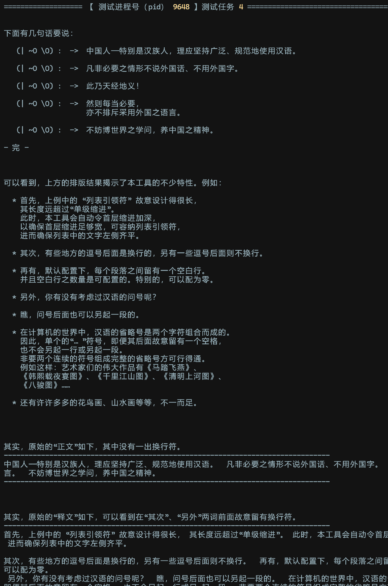

# 吴乐川的文本简易分割工具与文本简朴排版工具


<link rel="stylesheet" href="./node_modules/@wulechuan/css-stylus-markdown-themes/源代码/发布的源代码/文章排版与配色方案集/层叠样式表/wulechuan-styles-for-html-via-markdown--vscode.default.min.css">


> 中国人——特别是汉族人，理应坚持广泛、规范地使用汉语。凡非必要之情形不说外国话、不用外国字。此乃天经地义！然则每当必要，亦不排斥采用外国之语言。不妨 **博世界之学问，养中国之精神** 。
>
> 本人亦支持少数民族坚持采用自己民族的传统语言。仍须强调，凡中国人，皆应会用汉语、积极使用汉语，此乃中华各民族之大一统之必由。


## NPM 页

<dl>
<dt>NPM 包名</dt>
<dd>

[@wulechuan/text-basic-typography](https://www.npmjs.com/package/@wulechuan/text-basic-typography)

</dd>
<dt>作者</dt>
<dd><p>南昌吴乐川</p></dd>
</dl>

## 源代码仓库

| <span style="display:inline-block;width:10em;">提供仓库服务之组织</span> | <span style="display:inline-block;width:10em;">仓库组织之国别</span> | 仓库地址 |
| ------------- | :----------: | ------- |
| 码云           | 中华人民共和国 | [https://gitee.com/nanchang-wulechuan/wulechuan-typescript-text-basic-typography.git](https://gitee.com/nanchang-wulechuan/wulechuan-typescript-text-basic-typography.git) |
| 阿里云之代码仓库 | 中华人民共和国 | [https://code.aliyun.com/wulechuan/wulechuan-typescript-text-basic-typography.git](https://code.aliyun.com/wulechuan/wulechuan-typescript-text-basic-typography.git) |
| GitHub         | 美           | [https://github.com/wulechuan/wulechuan-typescript-text-basic-typography.git](https://github.com/wulechuan/wulechuan-typescript-text-basic-typography.git) |


## 简介

### 言简意赅版

#### 功用

本工具集包含甲乙两款工具：

-   甲按特定要求将一个文本（“`string`”）分割成片段，形成文本列表（“`string[]`”）。
-   乙接受一个文本，要求此文本事先含有特别的记号供乙识别，并据此类记号在原文本之基础上添加空格与换行符（“`\n`”）等内容，产出另一新的文本。由是，当在纯文字环境（例如命令行形式的会话环境）中呈现该产出之新文本时，这些文字会因具有简朴的排版而**视觉效果更佳**。又，乙调用甲。

    > 乙要求预留在原文本中的记号是比较“含蓄”的，仅为空格一种，别无其它。

**主观上，将文字排版是我们的最终目的，因此乙应视为本工具集之主体。** 甲为辅助。

#### 用法的极简说明

口诀二则：

1.  标点之后 **【一】个空格，另起一【行】；【多】个空格，另起一【段】。**
2.  **【后引号】比“别人”多费一个空格。** 

口诀易记，但口诀之外另有少数细则待究。参阅下文。

#### 其他特点

本工具集之代码广泛采用汉语。例如：

-   ```js
    import {
        将原文本改造为包含简朴排版的新文本,
    } from '@wulechuan/text-basic-typography'

    console.log(将原文本改造为包含简朴排版的新文本({
        原文本: '《九色鹿》是根据敦煌壁画《鹿王本生》故事改编， 由中国上海美术电影制片厂 1981 年出品的动画美术作品。',
        列表引领符: '',
    }).排版好的内容全文)
    ```


### 冗长版

#### 由来

我们在很多时候，**不便**或**不愿**在一个长文本中留存换行符（“`\n`”），更**不便**或**无法**在文本中保留诸如【列表】、【段落】等略复杂的**排版信息或记号**。另一方面，当呈现该文本时，我们又期望有一些排版，哪怕颇为简朴。

例如，我们希望长文可形成多个段落，每个段落还各自带有列表引领符（外国话是“list marker”或“list bullet”）。典型的，每个列表段落由其左侧的一个小圆点引领。

屡屡遭遇此类问题，我遂设计此工具集以作应对。

#### 本工具集之功用

须知，前述关于文字排版之愿望实际上涉及 3 个不同的任务：

1.  将原文本按要求分割，形成多个文本片段；
2.  将多个片段排版，并汇总形成原文本之变体。当然，该变体仍为文本。
3.  呈现含有排版信息的上述文本变体。常见的做法是交由 `console.log` 、`console.debug` 等。

本工具集中即包含两款工具，分别应对前 2 种任务。

-   甲按特定要求将一个文本（“`string`”）分割成片段，形成文本列表（“`string[]`”）。

    不妨指出，虽然甲负责分割文本为多个片段。**但具体依据何种记号、在何处分割，是可以配置的，即由甲之外界决定，而非由甲自身决定。**

-   乙接受一个文本，要求此文本事先含有特别的记号供乙识别，并据此类记号在原文本之基础上添加空格与换行符（“`\n`”）等内容，产出另一新的文本。由是，当在纯文字环境（例如命令行形式的会话环境）中呈现该产出之新文本时，这些文字会因具有简朴的排版而**视觉效果更佳**。又，乙调用甲。

**主观上，将文字排版是我们的最终目的，因此乙应视为本工具集之主体。** 甲为辅助。

虽然主观上乙为本工具集之主体，但客观上本工具集对甲、乙两款工具并列给出，因此，*所谓“本工具集之功用”不应一概而论，* 请另见下文甲、乙各自的功用介绍。

又，本工具集是依托于 npm 服务框架构建的，亦依托其发行。当然，本工具集（对外发行的部分）恰好不依赖任何外来代码运转，故获取本工具之后，其运转可以脱离 npm 服务框架。


#### 工具甲之功用

工具甲由唯一的接口函数 `对文本列表逐项分割并将结果列表展平` 体现。

该函数接受原文信息，并据此有所产出。原文可以是文本列表（“`string[]`”），也可以是单一文本（“`string`”）。

-   如果原文是文本列表（“`string[]`”），本程序会

    1.  将其中的所有文本逐一分割，故从每一个原始文本各得到一个文本片段列表（“`string[]`”）。
    1.  将这些文本片段列表汇总在一个列表中，临时得到一个双层嵌套列表，即 （“`string[][]`”）。
    1.  将该双层嵌套列表展平，得到单层的文本列表（“`string[]`”），并输出该单级文本列表。

-   如果给出的原文是一个文本“`string`”）而非文本列表（“`string[]`”），则本函数会先创建一个列表，将该文本包裹其中，而后照常处理该列表。


#### 工具乙之功用

工具乙用以对某给出的文本进行处理，处理之产出很丰富，但**产出之主体为原文本之修订版，即另一文本。该产出之文本内含多处换行符（“`\n`”）。** 由是，当在纯文字环境（例如命令行形式的会话环境）中呈现该产出之文本时，因具有简朴的排版而**视觉效果更佳**。

不妨指出，甲对文字分割时，对须采用的分割符并不做具体要求，它是一款“更”通用的辅助工具。参阅上文《[工具甲之功用](#工具甲之功用)》。

**乙借助甲对文本进行分割，文本分割的规则（或者说要求）由乙决定。而非由甲决定** 具体如下：

1.  乙要求原文本中事先插入（或者说留有）**特定的记号，供乙识别。** 乙依据这些记号调用甲来分割原文本。**分割后有两种可能的处理：【另起一行】或【另起一段】。**

    -   所谓【另起一行】，无非是此处新添一个换行符（“`\n`”）。

    -   所谓【另起一段】，首先是视具体配置在该处添加一个或多个换行符，*默认为 2 个*。其次，每个所谓段落之前可以添加【列表引领符】，形成段落列表。


2.  这些记号的应用规则及效果可简化为口诀二则：

    1.  标点之后 **【一】个空格，另起一【行】；【多】个空格，另起一【段】。**
    2.  **【后引号】比“别人”多费一个空格。** 

    口诀易记，但口诀之外另有少数规则待究。见下文。

    > 可见，乙要求预留在原文本中的记号还是比较“含蓄”的，仅为空格。

3.  口诀仅为方便记忆。口诀之外还有几条细则。如下。

    1.  【原文本】自身就包含的换行符（“`\n`”或“`\r`”）。

        -   若单独存在（即相邻再无旁他换行符），其会被删去。文本则会在其原来的位置分割，以便另起一【**行**】。

        -   若连续多个换行符彼此紧邻，它们均会被删去。文本则会在其原来的位置分割，以便另起一【**段**】。

        -   若单个换行符之后有 **一个或多个空格** 跟随，则换行符与后续空格会一并删去。文本则会在其原来的位置分割，以便另起一【**段**】。

        > 特别的，“`\r\n`”二者连用视作【**单**】个换行符。
        >
        > 但除此情形外，“`\n`”、“`\r`”二者不可混合连用，即“`\n\r`”是不标准的写法，效果难以期料。本人也无意尝试。

    1.  **【原文本】中的任何标点符号，如果后面 _没有_ 空格跟随，则该标点符号之后无任何特别的排版处理。**

    1.  凡**汉语的**【句号】、【感叹号】、【问号】、【冒号】和【省略号】：

        -  若后面仅 **唯一一个** 空格跟随，则该空格会被删去。且上述标点符号之后另起一【**行**】。

        -  若后面有 **多个** 空格跟随，则这些空格会被删去。且上述标点符号之后另起一【**段**】。

    1.  凡**汉语的**【顿号】、【逗号】和【分号】，若后面有 **一个或多个** 空格跟随，则这些空格会被删去。且上述标点符号之后另起一【**行**】。 *不妨强调，这些标点之后 __永无可能__ 另起一【段】。*

    1.  汉语【*后*引号】较为特殊：

        -   若后面 _没有_ 空格跟随，照例不做任何处理。

        -   **若后面仅 _唯一一个_ 空格跟随，仍不做任何处理！**

            这是因为，不少时候为了视觉美观我（们）会故意在【前引号】之前、【后引号】之后各留一个空格。此时，我（们）的意图 _并不是_ 暗示本工具在此【后引号】之后另起一行。

        -   若后面 **恰好有 2 个** 空格跟随，则这两个空格会被删去。且该【后引号】之后会另起一【**行**】。
            由此，保留的空格会留在行末，此乃有意为之。

        -   若后面有 **3 个或更多** 空格跟随，则这些空格全会被删去。且该【后引号】之后会另起一【**段**】。

        > 不妨重申相关口诀： **【后引号】比“别人”多费一个空格。**


-----


## 安装与使用

### 安装

本工具集是依托于 npm 服务框架构建的，亦依托其发行。当然，本工具集（对外发行的部分）恰好不依赖任何外来代码运转，故获取本工具之后，其运转可以脱离 npm 服务框架。

既然本工具集依托 npm 发行，各位安装本工具集也不妨借助 npm 。脱离 npm 来安装本工具集则略为繁琐。依托 npm 服务框架来安装本工具集之方法如下：

1.  确保你的计算机或你的容器中已经安装了 Nodejs。见《[Nodejs 官方下载页](https://nodejs.org/zh-cn/download/)》。

1.  虽然 Nodejs 往往会随附一个名为 npm 的工具。但是，一来此事并不一定（例如 Ubuntu 环境的 Nodejs 有可能并不附带 npm）；二来即便 Nodejs 附带了一份 npm，该 npm 之版本也未必最新的。**故而，推荐安装 _最新版_ 的 npm 。**

    - 以下方法假定你所安装的 Nodejs 确实随附了一份 npm，并利用该随附的、较旧版本的 npm 来安装最新版的 npm 。

        ```bash
        # Bash 或 PowerShell
        npm  i  -g  npm
        ```

    - 以下假定在 Ubuntu 系统安装 Nodejs 之后， npm 仍未安装。从零开始安装 npm 的步骤如下。

        ```bash
        apt  update
        apt  install  npm
        ```


1.  借助 `cd` 命令来到你的项目**根**文件夹，再用以下命令将你的项目初始化成一个 npm 项目。

    ```bash
    # Bash 或 PowerShell
    npm  init  -y
    ```

    > 具体而言，npm 将在该文件夹内创建一个文件，名为“ `package.json` ”，仅此而已。该文件是一切 npm 项目的关键配置，也是该类项目的本质特征。

1.  借助 npm 正式安装本工具集。

    ```bash
    # Bash 或 PowerShell
    npm  i  -D  @wulechuan/text-basic-typography
    ```

### 使用


#### 工具甲之使用

##### 工具甲之编程接口

工具甲由唯一的接口函数 `对文本列表逐项分割并将结果列表展平` 体现。该函数的接口（外国话所谓“Signature”）如下：

```typescript
export type 范_对文本列表逐项分割并将结果列表展平 = {
    (配置项集: {
        原文本或原文本列表: string[];
        分割符或分割正则表达式?: string | RegExp;
        在分割符处须补回的内容?: string;
    }): string[];

    (配置项集: {
        原文本或原文本列表: string;
        分割符或分割正则表达式?: string | RegExp;
        在分割符处须补回的内容?: string;
    }): string;

    (配置项集?: {
        原文本或原文本列表?: any;
        分割符或分割正则表达式?: string | RegExp;
        在分割符处须补回的内容?: string;
    }): any;
}

export const 对文本列表逐项分割并将结果列表展平: 范_对文本列表逐项分割并将结果列表展平 = 配置项集 => {
    /* 函数体，从略。 */
}
```


###### 工具甲的 `配置项集`


本函数接受唯一的参数，不妨称 `配置项集` ，其应为一个对象。在其中可以给出以下 3 个属性。

1. `配置项集.原文本或原文本列表`：

    顾名思义，该值可为文本或文本列表。

    若为文本，则本函数会先创建一个列表，将该文本包裹其中，而后照常处理该列表。

2. `配置项集.分割符或分割正则表达式`：

    顾名思义，可为文本，亦可为正则表达式实例。用以分隔原文本列表中的每一项文本。

3. `配置项集.在分割符处须补回的内容`：

    我们知道， JavaScript 和 TypeScript 中的字符串分割函数（“`split`”）
    **无法**在分割得到的结果列表中**包含分割符本身。即，分割符会消失在结果中。**
    为确保原文本在经历排版设计后内容仍完整无缺，需在分割后将那些用作分割符的字符补回。此项即为须补回的字符。

    > 顺便指出，该用于“补回”的字符可以任意设计，故实际上可以实现对用作分割符的文本进行“偷换”。

    还需注意，

    -   如果 `配置项集.分割符或分割正则表达式` 是文本，
        则 `配置项集.在分割符处须补回的内容` 可以省略。

        若省略，则其取值会照搬前者（即 `配置项集.分割符或分割正则表达式` ）。丢失什么就补回什么，这也合乎常情。

    -   如果 `配置项集.分割符或分割正则表达式` 是正则表达式，
        则 `配置项集.在分割符处须补回的内容` **虽仍可以省略，但本程序会给出警告。因为，从正则表达式的 “`.toString`” 得到的文本视作“补回的”文本往往是不合适的！**

    -   **另需指出，补回的文本配置为“空字符串”是允许的，不会视为省略。**


##### 工具甲之用法示范集

###### 工具甲之用法示范 1

下例系由 JavaScript 语言写成。

```js
测试任务己()

function 测试任务己 () {
    // 这里故意试一试调用工具甲时，英语标点符号可否在其后顺利分割。
    // 需指出，本工具集中的工具乙是不处理任何英语标点符号的。

    let 文本列表 = 对文本列表逐项分割并将结果列表展平({
        原文本或原文本列表: 'By understanding how JavaScript works, TypeScript can build a type-system that accepts JavaScript code but has types. This offers a type-system without needing to add extra characters to make types explicit in your code.',

        /** 注意，该【半角句号】之后确有一个空格。 */
        分割符或分割正则表达式: '. ',

        /** 注意，该【半角句号】之后并没有空格。 */
        在分割符处须补回的内容: '.',
    })

    文本列表 = 对文本列表逐项分割并将结果列表展平({
        原文本或原文本列表: 文本列表,

        /** 注意，该【半角逗号】之后确有一个空格。 */
        分割符或分割正则表达式: ', ',

        /** 注意，该【半角逗号】之后并没有空格。 */
        在分割符处须补回的内容: ',',
    })

    文本列表 = 对文本列表逐项分割并将结果列表展平({
        原文本或原文本列表: 文本列表,

        /**
         * 凡词尾为小写字母 s 者，其后分割。
         * 注意，该 s 之后确有一个空格。
         */
        分割符或分割正则表达式: 's ',

        /**
         * 注意，该 s 之后并没有空格。
         */
        在分割符处须补回的内容: 's',
    })

    console.log(文本列表)
}
```


本例之输出如下：

```ps1
[
  'By understanding how JavaScript works,',
  'TypeScript can build a type-system that accepts',
  'JavaScript code but has',
  'types.',
  'This',
  'offers',
  'a type-system without needing to add extra characters',
  'to make types',
  'explicit in your code.'
]
```


###### 工具甲之用法示范 2

下例系由 TypeScript 语言写成。


```typescript
const 原文本 = '2014 年 3 月，欧特克公司发布 SOFTIMAGE 全线产品的停产声明。 Softimage|xsi 2015 版将成为该软件最后的发行版本。 其中诸多优秀功能（特别是 ICE）将被逐一移植到 Maya 中。  自此，争斗多年的 Maya 和 SOFTIMAGE|XSI（后更名为 Softimage|xsi）， 以前者“吞噬”后者而告终。'

let 各段落文本之列表: string[] = [ 原文本 ]

;[
    { 分割符或分割正则表达式: /。 {2,}/, 在分割符处须补回的内容: '。' },
    { 分割符或分割正则表达式: /！ {2,}/, 在分割符处须补回的内容: '！' },
    { 分割符或分割正则表达式: /？ {2,}/, 在分割符处须补回的内容: '？' },
    { 分割符或分割正则表达式: /” {3,}/, 在分割符处须补回的内容: '”' },
    { 分割符或分割正则表达式: /： {2,}/, 在分割符处须补回的内容: '：' },
    { 分割符或分割正则表达式: /…… {2,}/, 在分割符处须补回的内容: '……' },

    { 分割符或分割正则表达式: /\n{2,}|\n +/,       在分割符处须补回的内容: '' },
    { 分割符或分割正则表达式: /\r{2,}|\r +/,       在分割符处须补回的内容: '' },
    { 分割符或分割正则表达式: /(\r\n){2,}|\r\n +/, 在分割符处须补回的内容: '' },
].forEach(分割方案 => {
    各段落文本之列表 = 对文本列表逐项分割并将结果列表展平({
        原文本或原文本列表: 各段落文本之列表,
        ...分割方案,
    })
})
```


#### 工具乙之使用


##### 工具乙之编程接口

工具甲由唯一的接口函数 `将原文本改造为包含简朴排版的新文本` 体现。该函数的接口描述符（外国话所谓“Signature”）如下：

```typescript
export type 范_将原文本改造为包含简朴排版的新文本_排版配置 = {
    /** @default {0}     【半角数字零】。 */
    整体缩进级数: number;

    /** @default {'    '} 四个【半角空格】。 */
    整体缩进之文本: string;

    /** @default {'- '}  【半角减号】后跟一个【半角空格】。 */
    列表引领符: string;

    /** @default {'    '} 四个【半角空格】。 */
    首层缩进之文本: string;

    /** @default {'    '} 四个【半角空格】。 */
    首层缩进之文本_并含整体缩进: string;

    /** @default {'  - '} */
    首层缩进之文本_含列表引领符: string;

    /** @default {'  - '} */
    首层缩进之文本_含列表引领符_并含整体缩进: string;

    /** @default {'    '} 四个【半角空格】。本工具自身暂时不采用该值，但不妨供外界使用。 */
    非首层之单层缩进之文本: number | string;

    /** @default {1}     【半角数字壹】 */
    各段落间的额外空白行数: number;

    单行最大视觉宽度等效英语字母个数?: number; // TODO 暂未实现。勿用。
}

export type 范_将原文本改造为包含简朴排版的新文本_分割得到的内容结构树 = string[][];

export type 范_将原文本改造为包含简朴排版的新文本_产出 = {
    排版好的内容全文: string;
    分割好的内容结构树: 范_将原文本改造为包含简朴排版的新文本_分割得到的内容结构树;
    最终采纳的排版配置: 范_将原文本改造为包含简朴排版的新文本_排版配置;
}

export declare function 将原文本改造为包含简朴排版的新文本 ({
    原文本,
    单层缩进空格数或单层缩进之文本,
    列表引领符,
    整体缩进级数,
    各段落间的额外空白行数,
}: {
    原文本?: string;

    /** @default {'- '}  【半角减号】后跟一个【半角空格】。 */
    列表引领符?: string;

    /** @default {'    '} 四个【半角空格】。 */
    单层缩进空格数或单层缩进之文本?: string;

    /** @default {0}     【半角数字零】。 */
    整体缩进级数?: number;

    /** @default {1}     【半角数字壹】 */
    各段落间的额外空白行数?: number;
} = {}): 范_将原文本改造为包含简朴排版的新文本_产出
```

###### 工具乙的 `配置项集`

本函数接受唯一的参数，不妨称 `配置项集` ，其应为一个对象。在其中可以给出以下 5 个属性。


1. `配置项集.原文本`：顾名思义。


2. `配置项集.列表引领符`：顾名思义。

    若该值**省略**，或该值给出**但不为空字符串**，则段落的所有文字左沿非但会齐平，而且会统一缩进，给左侧的【列表引领符】让出位置。

    该值允许配置为空字符串，意味着不采用【列表引领符】。段落的所有文字左沿仍会保持齐平，但它们不会再有针对【列表引领符】的统一的缩进。当然，全局的所谓“整体缩进”仍会保留。


3. `配置项集.单层缩进空格数或单层缩进之文本`：顾名思义。

    需注意，如果单层缩进空格数或单层缩进之文本宽度不及 `配置项集.列表引领符` ，则本工具会自动加大首层缩进，以确保首层缩进足够宽，可容纳 `配置项集.列表引领符` 。进而确保各段落中的文字左侧齐平。

    又，本工具排版暂时仅涉及首层缩进，并不涉及更深层的内容缩进。故一旦首层缩进有异于给出的“单层缩进空格数或单层缩进之文本”，则“单层缩进空格数或单层缩进之文本”在本呈现内部无用武之地。但“单层缩进空格数或单层缩进之文本”仍会输出，供外界采用。

4. `配置项集.整体缩进级数`：顾名思义。


5. `配置项集.各段落间的额外空白行数`：顾名思义。


##### 工具乙之用法示范集

不妨参见本工具集随附的测试集：《[./测试集/index.js](./测试集/index.js)》。

另见下列，其与测试集大体相同，但有所简略。

###### 工具乙之用法示范 1

下例系由 JavaScript 语言写成。

```javascript
console.log(将原文本改造为包含简朴排版的新文本({
    原文本: '时间要打多久，我讲我们不要做决定。 过去是由杜鲁门，以后是由艾森豪威尔， 或者是美国的将来的什么总统，由他们去决定。 就是说他们要打多久就打多久！ 一直打到完全胜利！',
    列表引领符: '',
}).排版好的内容全文)
```


###### 工具乙之用法示范 2

下例系由 JavaScript 语言写成。

```javascript
测试任务丁()

function 测试任务丁 () {
    const 正文原文 = '中国人——特别是汉族人，理应坚持广泛、规范地使用汉语。  凡非必要之情形不说外国话、不用外国字。  此乃天经地义！  然则每当必要， 亦不排斥采用外国之语言。  不妨博世界之学问，养中国之精神。'

    const 释文原文 = '首先，“列表引领符”故意很长，其长度远超过“单级缩进”。 此时，本工具会自动令首层缩进加深， 以确保列表中的文字左侧齐平。\n\n其次，有些地方的逗号后面是换行的，另有一些逗号后面则不换行。  再有，默认配置下，每个段落之间留有一个空白行。 并且空白行之数量是可配置的。特别的，可以配为零。\n 另外，你有没有考虑过汉语的问号呢？  瞧，问号后面也可以另起一段的。  在计算机的世界中，汉语的省略号是两个字符组合而成的。 因此，单个的“… ”符号，即便其后面故意留有一个空格， 也不会另起一行或另起一段。 非要两个连续的符号组成完整的省略号方可行得通。 例如这样：艺术家们的伟大作品有《马踏飞燕》、 《韩熙载夜宴图》、《千里江山图》、《清明上河图》、 《八骏图》……  还有许许多多的花鸟画、山水画等等，不一而足。'

    const {
        排版好的内容全文:   排版好的内容全文_正文,
        分割好的内容结构树: 分割好的内容结构树_正文,
        最终采纳的排版配置: 正文最终采纳的排版配置,
    } = 将原文本改造为包含简朴排版的新文本({ // ***** 留意此处调用了工具乙。*****
        原文本: 正文原文,
        列表引领符: '(| ~O \\O) :  ->  ',
    })

    const {
        排版好的内容全文:   排版好的内容全文_注释,
        分割好的内容结构树: 分割好的内容结构树_注释,
    } = 将原文本改造为包含简朴排版的新文本({ // ***** 留意此处调用了工具乙。*****
        原文本: 释文原文,

        ...正文最终采纳的排版配置,

        列表引领符: '* ',
    })

    console.log(`${
        '下面有几句话要说：'
    }\n\n${
        排版好的内容全文_正文
    }\n\n- 完 -\n\n\n\n${
        '可以看到，上方的排版结果揭示了本工具的不少特性。例如：'
    }\n\n${
        排版好的内容全文_注释
    }\n\n\n`)

    console.log('\n其实，原始的“正文”如下，其中没有一出换行符。')
    console.log(`${'-'.repeat(79)}\n${正文原文}\n${'-'.repeat(79)}\n\n`)
    console.log('\n其实，原始的“释文”如下，可以看到在“其次”、“另外”两词前面故意留有换行符。')
    console.log(`${'-'.repeat(79)}\n${释文原文}\n${'-'.repeat(79)}\n\n`)

    console.log('\n\n\n')
    console.log(分割好的内容结构树_正文)
    console.log(`\n${'-'.repeat(79)}\n`)
    console.log(分割好的内容结构树_注释)
    console.log('\n\n\n')
}
```

本例之输出如下图所示：



中国大陆境内或可查阅《[存放于码云的图片文件](https://gitee.com/nanchang-wulechuan/wulechuan-typescript-text-basic-typography/blob/master/%E6%96%87%E6%A1%A3%E9%9B%86/%E6%8F%92%E5%9B%BE%E9%9B%86/%E6%B5%8B%E8%AF%95%E4%BB%BB%E5%8A%A13%E4%B9%8B%E8%BE%93%E5%87%BA%EF%BC%88%E9%83%A8%E5%88%86%EF%BC%89.png)》。


## 许可证类型

WTFPL

> 注意：
>
> 我未研究过许可证的约束。因此姑且声明为 WTFPL 类型。但实际上该许可证类型可能与我采用的开源模块有冲突。

